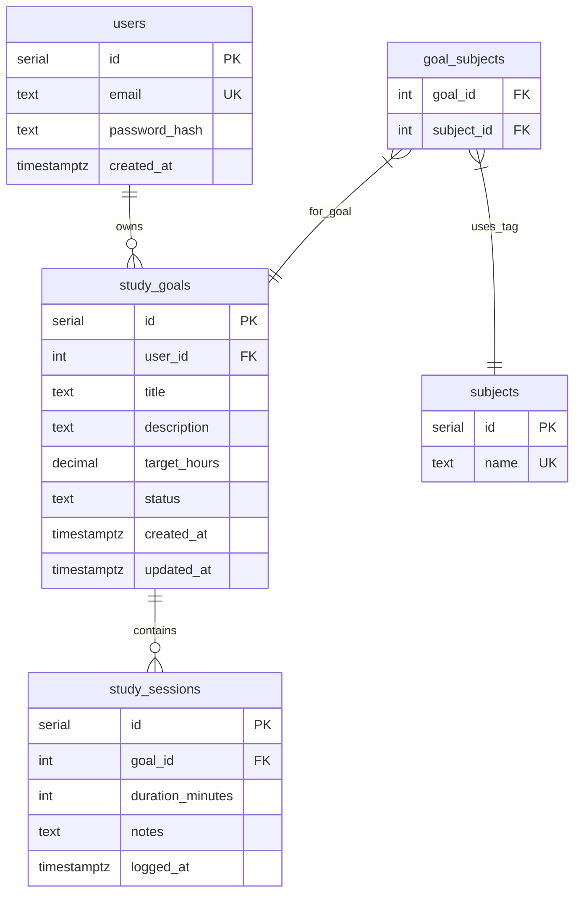

# Entity Relationship Diagram

## Create the List of Tables

| Table | Purpose |
|-------|---------|
| `users` | Accounts for learners (email, credentials). |
| `study_goals` | Per-user goals (title, target hours, status, timestamps). |
| `subjects` | Reusable subject/tag labels (e.g. CS, Biology). |
| `goal_subjects` | Many-to-many: which subjects apply to which goal. |
| `study_sessions` | Logged work blocks linked to a goal (duration, notes, time). |

Relationships: **users → study_goals** (one-to-many), **study_goals → study_sessions** (one-to-many), **study_goals ↔ subjects** (many-to-many via `goal_subjects`).

## Add the Entity Relationship Diagram

### Table outlines (columns)

**users**

| Column Name | Type | Description |
|-------------|------|-------------|
| id | serial | Primary key |
| email | text | Unique login |
| password_hash | text | Hashed password |
| created_at | timestamptz | Account creation |

**study_goals**

| Column Name | Type | Description |
|-------------|------|-------------|
| id | serial | Primary key |
| user_id | integer | FK → users.id |
| title | text | Goal name |
| description | text | Optional details |
| target_hours | decimal | Planned hours |
| status | text | e.g. active, paused, completed |
| created_at | timestamptz | Created |
| updated_at | timestamptz | Last change |

**subjects**

| Column Name | Type | Description |
|-------------|------|-------------|
| id | serial | Primary key |
| name | text | Tag name (unique) |

**goal_subjects**

| Column Name | Type | Description |
|-------------|------|-------------|
| goal_id | integer | FK → study_goals.id (composite PK with subject_id) |
| subject_id | integer | FK → subjects.id |

**study_sessions**

| Column Name | Type | Description |
|-------------|------|-------------|
| id | serial | Primary key |
| goal_id | integer | FK → study_goals.id |
| duration_minutes | integer | Session length |
| notes | text | Optional notes |
| logged_at | timestamptz | When the session occurred |
