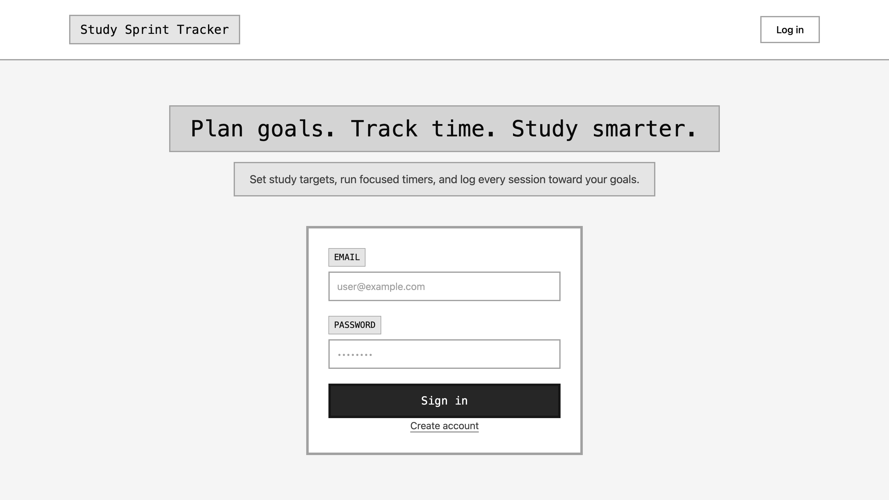
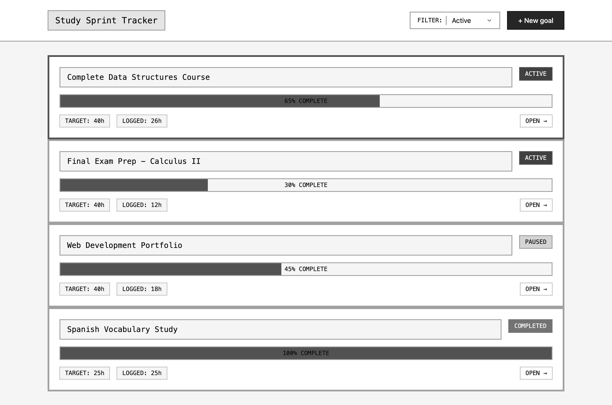
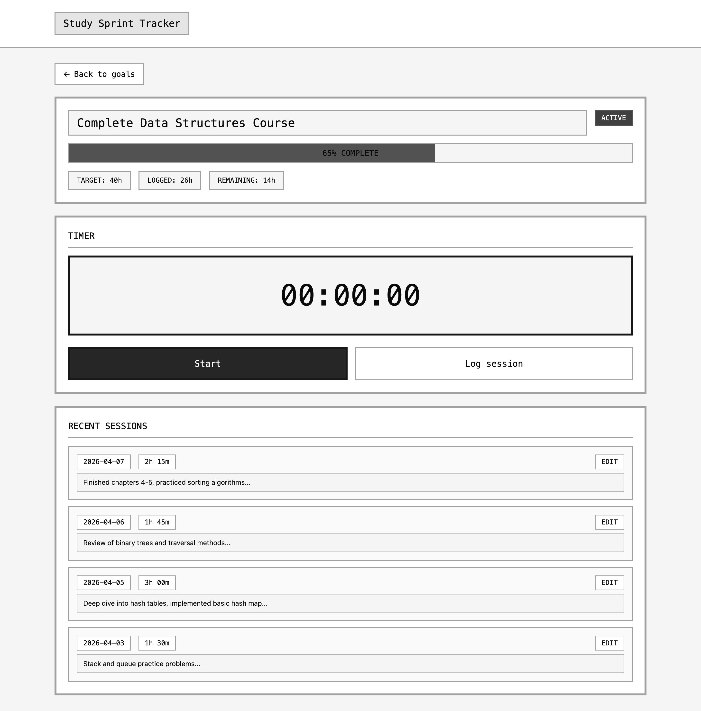

# Wireframes

Reference the Creating an Entity Relationship Diagram final project guide in the course portal for more information about how to complete this deliverable.

## List of Pages

| Page | Route (planned) | Notes |
|------|-----------------|--------|
| Landing / login | `/` | Entry for guests; redirect to dashboard when authenticated |
| Dashboard (goals list) | `/dashboard` or `/goals` | Primary hub after login |
| Goal detail | `/goals/:id` | Progress, sessions, timer, modal |
| Session log (same page) | (no separate route) | Modal + inline list on goal detail |

**Pages with wireframes below (⭐):** Landing, Dashboard, Goal detail (session modal shown on goal detail).

---

## Wireframe 1: Landing / login ⭐

Focus: guest entry, authentication fields, and redirect to dashboard after sign-in.

Reference image: [`assets/landing-login.png`](./assets/landing-login.png)

---

## Wireframe 2: Dashboard (goals list) ⭐

Focus: active goal list, progress visibility, filter controls, and add-goal entry point.

Reference image: [`assets/dashboard-goals.png`](./assets/dashboard-goals.png)

---

## Wireframe 3: Goal detail (timer + sessions + modal) ⭐

Focus: per-goal progress, timer actions, recent sessions, and same-page modal logging flow.

Reference image: [`assets/goal-detail.png`](./assets/goal-detail.png)

The session log uses a **modal** over the goal page so the user does not navigate away (baseline: same-page interaction).

---

## Wireframe 4 (optional): Slide-out details panel

Concept: goal detail page with a narrow right-side metadata panel (subjects/tags, created date).

Custom feature from README: slide-out details panel complements the modal pattern.
